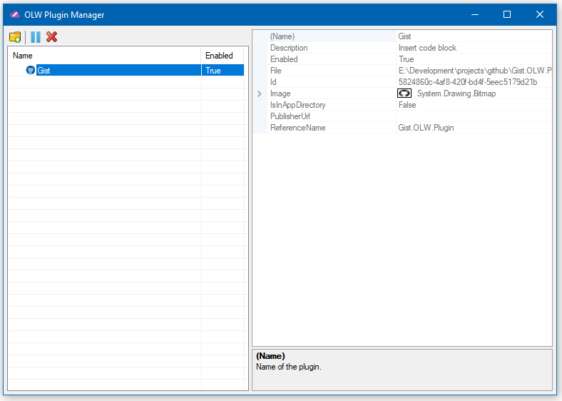

# OLW Plugin Manager

A simple tool to manage plugins for [Open Live Writer](http://openlivewriter.org/)

---

It will load information for plugins that are located in the Open Live Writer install directory. It will also show plugins that are described in the registry, the second place that Open Live Writer will load plugins from. 

It has functionality to `disable` a plugin. To do this, it will either move the plugin from the install directory to a `DisabledPlugins` directory located in the install directory, or it will remove if from the registry key to another `DisabledPlugins` key.

If you disable, enable, or remove a plugin, you will need to restart Open Live Writer for it to take affect.